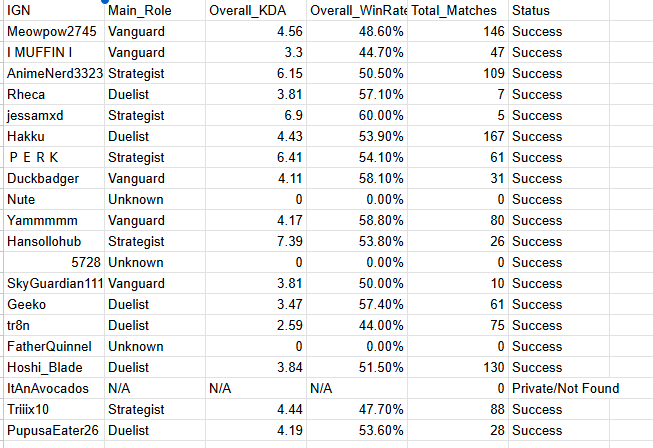

# Marvel Rivals — Esports Draft Analytics Pipeline

> **Automatically pull tracker.gg stats for every player in your draft pool and export them to a clean CSV — ready for captain review, seeding, or team-building.**

---

## 📋 Table of Contents

- [Overview](#overview)
- [How It Works](#how-it-works)
- [Project Structure](#project-structure)
- [Prerequisites](#prerequisites)
- [Setup & Installation](#setup--installation)
- [Input Format](#input-format)
- [Running the Pipeline](#running-the-pipeline)
- [Output Format](#output-format)
- [Sample Data](#sample-data)
- [Rate Limiting & Cloudflare](#rate-limiting--cloudflare)
- [Disclaimer](#disclaimer)

---

## Overview

When running an esports draft for a Marvel Rivals community tournament, manually looking up every player's stats on [tracker.gg](https://tracker.gg/marvel-rivals) is painfully slow. This pipeline automates the entire process:

1. You collect player sign-ups in a Google Form → export to CSV
2. This script reads each player's **In-Game Name (IGN)** from the CSV
3. It hits the **tracker.gg API** for each player and pulls live stats
4. All results are written to a clean output CSV ready for your captains

No API key required. Works by bypassing Cloudflare protections via [`cloudscraper`](https://github.com/VeNoMouS/cloudscraper).

---

## How It Works

```
ign_SAMPLE.csv            Tracker.py               draft_stats_SAMPLE.csv
┌─────────────────┐       ┌──────────────────┐      ┌──────────────────────┐
│  IGN            │──────▶│ cloudscraper.get  │─────▶│ PLAYER OVERVIEW      │
│  IGN            │       │ tracker.gg API   │      │ HERO BREAKDOWN       │
│  IGN            │       │                  │      │ ROLE WR SUMMARY      │
│  ...            │       │ parse segments[] │      │                      │
└─────────────────┘       │ top 5 heroes     │      │ (3-section CSV)      │
                          └──────────────────┘      └──────────────────────┘
```

### API Response Structure

The tracker.gg API returns a list of **segments**:

| Segment | Type | Contents |
|--------|------|----------|
| `segments[0]` | `overview` | KDA, Win Rate, Matches Played, Current Rank |
| `segments[1..N]` | `hero` | Per-hero stats (sorted by playtime) |

The pipeline grabs the overview stats + the top 5 heroes by playtime.

---

## Project Structure

```
Esports-Draft-Analytics-Pipeline/
│
├── Tracker.py                  # Main pipeline script
├── debug_api.py                # One-shot API tester for a single IGN
│
├── ign_SAMPLE.csv             # Example input — IGNs of known MR players/streamers
├── draft_stats_SAMPLE.csv      # Example output (dummy data — safe to commit)
│
├── requirements.txt            # Python dependencies
├── .gitignore                  # Excludes real player data from git
└── README.md                   # You are here
```

> ⚠️ **`Rivals_Draft.csv` and `draft_stats.csv` are in `.gitignore`** — your real player data never leaves your machine.

---

## Prerequisites

- Python 3.8+
- pip

---

## Setup & Installation

```bash
# 1. Clone the repo
git clone https://github.com/YOUR_USERNAME/marvel-rivals-draft-pipeline.git
cd marvel-rivals-draft-pipeline

# 2. (Optional but recommended) Create a virtual environment
python -m venv venv
venv\Scripts\activate        # Windows
# source venv/bin/activate   # macOS / Linux

# 3. Install dependencies
pip install -r requirements.txt
```

---

## Input Format

The input is a simple single-column CSV — just IGNs, nothing else required.

| Column | Field | Description |
|--------|-------|-------------|
| A | `IGN` | Player's in-game name — used for the tracker.gg API lookup |

**Example `ign_SAMPLE.csv`:**
```
IGN
Flats
ml7support
Wudijo
...
```

The script skips the header row and any blank rows. No roles, ranks, or Discord handles needed — just the IGN.

See [`ign_SAMPLE.csv`](ign_SAMPLE.csv) for the full list of 20 sample players.

---

## Running the Pipeline

```bash
# Default — reads ign_SAMPLE.csv, writes draft_stats_SAMPLE.csv
python Tracker.py

# To use your own IGN list (one IGN per line, header = 'IGN'):
# Edit the bottom of Tracker.py: pull_draft_stats(load_igns('my_igns.csv'), 'my_output.csv')
```

Progress is printed to the console as each player is fetched:

```
Fetching stats for Flats...
  Waiting 13.4s before next request...
Fetching stats for ml7support...
...
Done! Check draft_stats_SAMPLE.csv
```

---

## Output Format

The output CSV has **three sections**:

**Section 1 — Player Overview** (one row per player)

| Column | Description |
|--------|-------------|
| `IGN` | Player's in-game name |
| `Main_Role` | Role with the most matches played (Vanguard / Duelist / Strategist) |
| `Overall_KDA` | Overall KDA from the tracker.gg overview |
| `Overall_WinRate%` | Overall win rate |
| `Total_Matches` | Total matches on record |
| `Status` | `Success`, `Private/Not Found`, or `Error: <code>` |

**Section 2 — Hero Breakdown** (one row per player × top-5 hero)

| Column | Description |
|--------|-------------|
| `Hero_Rank` | 1 = most-played hero |
| `Hero` | Hero name |
| `Role` | Hero's class (Vanguard / Duelist / Strategist / Multi-Role) |
| `KDA` | KDA on this hero |
| `WinRate%` | Win rate on this hero |
| `Matches` | Matches played on this hero |

**Section 3 — Role Win Rate Summary** (one row per player × role)

| Column | Description |
|--------|-------------|
| `Role` | Vanguard, Duelist, or Strategist |
| `Weighted_WinRate%` | Match-weighted average WR across all heroes in that role |
| `Role_Matches` | Total matches played in that role |

See [`draft_stats_SAMPLE.csv`](draft_stats_SAMPLE.csv) for example output.

---

## Sample Data

| File | Description |
|------|-------------|
| [`ign_SAMPLE.csv`](ign_SAMPLE.csv) | 20 real Marvel Rivals players & streamers with public tracker.gg profiles |
| [`draft_stats_SAMPLE.csv`](draft_stats_SAMPLE.csv) | Example pipeline output (fabricated numbers) showing the 3-section format |

> Run the pipeline against `ign_SAMPLE.csv` to get real live data.

## Example Image



---

## Rate Limiting & Cloudflare

- **12–17 second delay** (with random jitter) between requests to avoid rate limiting
- Retries up to 3× on 429 with exponential backoff (60s / 120s / 180s)
- Creates a **fresh session per player** so a blocked session doesn't cascade
- Uses [`cloudscraper`](https://github.com/VeNoMouS/cloudscraper) with Chrome browser headers to handle Cloudflare
- Validates the response body is real JSON before parsing — gracefully handles Cloudflare challenge pages
- If a player's profile is private or not found, it writes `Private/Not Found` rather than crashing

---

## Disclaimer

This project is a **personal/community tool** built for fun and esports draft organization. It is:

- **Not affiliated with** Netease, Marvel, or tracker.gg
- **Not intended for commercial use**
- Dependent on tracker.gg's public API — if they change their API or add stricter rate limits, the script may break
- Respectful of rate limits — please do not abuse it

Use responsibly. 🦸
